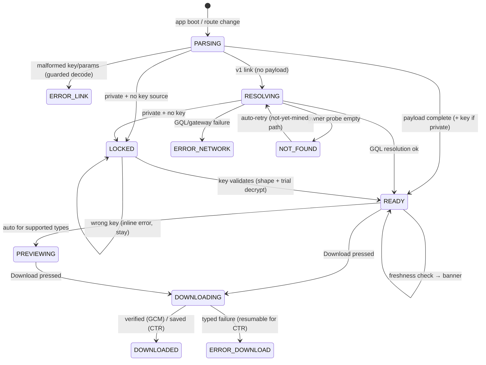

# File Sharing Redesign — Finalized Design

*Design document, not an audit. Evidence base: `docs/FILE_SHARING_VIEW_UX_REVIEW.md` (cross-referenced as F# / QW# / M# / B#). All product decisions herein are settled; where code reality constrains a decision, the constraint is stated with evidence and the nearest working alternative is specified.*

---

## 0. Verified corrections that shape this design

### 0.1 Cipher is size-dependent — confirmed

`packages/ardrive_uploader/lib/src/data_bundler.dart:664`: `if (fileLength < maxSizeSupportedByGCMEncryption)` → AES256-GCM, else AES256-CTR, with the threshold `MiB(100).size` (`packages/ardrive_uploader/lib/src/constants.dart:3`). Strict `<`: a file of exactly 100 MiB is CTR. GCM encrypt/decrypt is buffered (`packages/ardrive_crypto/lib/src/ciphers.dart:9-18`, `entities.dart:28-60`); CTR is streamed (`ciphers.dart:34-45`, `stream_aes.dart:86-118`).

### 0.2 CTR is seekable with a small change, not a rewrite — confirmed

`aesStreamTransformer` (`packages/ardrive_crypto/lib/src/stream_aes.dart:56-79`) hardcodes `var offsetBlocks = BigInt.from(0)` (`:60`) and derives each 256 KiB chunk's counter block as a **pure function** `counterBlock(nonce, offsetBlocks)` (`:64`, implementation `:112-117`), incrementing by a fixed `_webCryptoChuckSizeBlocks` (`:76`). Nothing carries state between chunks except the offset counter. Therefore: **decrypt-from-offset = initialize `offsetBlocks = startByte ~/ 16` instead of 0 and feed ciphertext from `startByte`.** The change is one optional parameter threaded through `decryptTransformer` → `aesStreamTransformer`, with the constraint that `startByte` be 16-byte aligned (align to the 256 KiB chunk size in practice, since `chunkTransformer(_webCryptoChunkSizeBytes)` re-chunks the input at `:58`). Resume-from-offset and range scrubbing are **small changes**.

### 0.3 Integrity today is worse than assumed — confirmed and extended

- CTR has no MAC anywhere: buffered path uses `Mac.empty` (`entities.dart:45`); streaming path has none by construction (`stream_aes.dart:86-118`).
- `packages/ardrive_crypto/lib/src/authenticate.dart` is 100% commented out; its own line 1 says it is used nowhere.
- **New finding (rate as P1, add to the review as F24): the GCM *streaming* path also skips authentication.** `AesGcmStream.decryptTransformer` trims the 16-byte MAC and decrypts via CTR-with-counter+2, with an explicit warning (`stream_aes.dart:120-149`). The web/desktop download path routes **both** ciphers through `decryptTransactionDataStream` (`lib/download/ardrive_downloader.dart:243-269` → `entities.dart:65-78` → `ciphers.dart:20-32`). Only mobile GCM takes the buffered, MAC-verified path (`ardrive_downloader.dart:81-104` → `entities.dart:40-43,56-58`). **Consequence: on web, no private file download of any size is cryptographically authenticated today.** Previews are authenticated for GCM only, because they use the buffered path (`lib/core/crypto/crypto.dart:180-191`).

### 0.4 The buffer/stream boundary hypothesis — validated

GCM ⇔ `< 100 MiB` ⇔ small enough to buffer, and the buffered `cryptography` decrypt verifies the MAC before returning a byte (`entities.dart:52-58`). CTR ⇔ `≥ 100 MiB` ⇔ needs streaming, and is seekable (§0.2). **The GCM tag-at-the-end problem is moot in practice**: no GCM file exceeds 100 MiB, so every GCM file can be buffered, verified, and only then written. The design below adopts the split wholesale (§3).

### 0.5 Small factual corrections

- `publicDownloadSafariSizeLimit` (`lib/download/limits.dart:10`) is not literally dead: it gates single-file downloads on Safari (`shared_file_download_cubit.dart:26-32`, `personal_file_download_cubit.dart:48-54`). It **is** absent from `calcDownloadSizeLimit`, whose web branch only distinguishes Firefox (`limits.dart:29-40`). Phase 2 rationalizes this (§5).
- XSS audit of the current preview path (§4.3): **clean** — no untrusted markup reaches the app-origin DOM today.

---

## 1. Link schema

### 1.1 Routes

| Route | Purpose | URL strategy |
|---|---|---|
| `/share/{fileId}` | Canonical share link (new) | Path-based (decision 3) |
| `/view/{txId}` | Generalized raw-transaction viewer (new) | Path-based |
| `/#/file/{fileId}/view` | Legacy share link | Honored forever via shim (§4) |
| `/#/drives/{driveId}…` | Drive/folder links | Unchanged this cycle |

### 1.2 Fields

Everything except `k` is non-secret. `c`/`iv` are public on-chain tags (`docs/ArweaveFS.md:43,121-122`); ciphertext length is public; filename/content-type are private-file secrets *only if the sharer hides them* (decision 2: embedded by default, hide toggle).

**[REVISED — 2026-08-07.] The fields below travel packed, in one query parameter, not as named parameters.** The first draft of this schema spelled every field out (`?v=2&dtx=…&mtx=…&own=…&n=…`). It never shipped — it existed only on the unmerged branch — so it was replaced rather than migrated, and there are no v1-style compatibility obligations for it. v1 `?fileKey=` links are unaffected and permanent. See §1.2.1 for the wire format and §1.2.2 for what the change bought.

| Field | Type | Where | Required | Secret | Absent ⇒ client behavior |
|---|---|---|---|---|---|
| `{fileId}` | uuid, path segment | path | yes | no | — (route doesn't match) |
| `d` | packed payload, base64url | query | yes for v2 semantics | no | Treat as v1: full GQL resolution (today's resolver, plus Phase-0 fixes) |
| version | byte 0 of `d`, `2` | payload | yes | no | A version this build does not know ⇒ the whole payload is dropped and the link resolves as v1 |
| `dtx` | txid, 32 bytes | payload | no, but required for the fast path | no | Resolve `dataTxId` via GQL before any fetch; page shows skeleton meanwhile |
| `mtx` | txid, 32 bytes | payload | no | no | Skip background verification (badge shows "Unverified link"); freshness check anchors on `own`+fileId GQL only |
| `own` | address, 32 bytes | payload | no | no | Owner resolved from `mtx` fetch, else first-writer GQL probe (`arweave_service.dart:1299+`); the "Shared by" line appears when it lands |
| `n` | filename, UTF-8, ≤120 ch and ≤255 bytes | payload | no | no (sensitive; hide-toggle omits it) | Header shows "Shared file" (public) / "Encrypted file" (private) until metadata resolves or decrypts |
| `s` | int bytes, ≤6 bytes big endian | payload | no | no | No size chip; preview budget checks fall back to post-`mtx` values; download progress switches to indeterminate until Content-Length arrives |
| `ct` | MIME: a table code, or UTF-8 | payload | no | no (same toggle as `n`) | Infer from `n`; else `application/octet-stream` → download-only card |
| `c` | `AES256-GCM` \| `AES256-CTR`, 2 bits | payload | private files: yes | no | One `getTransactionDetails` GQL at download/preview time (today's behavior, `shared_file_download_cubit.dart:69-77`) |
| `iv` | 12 bytes | payload | private files: yes | no | Same GQL fallback as `c` |
| `pin` | 1 bit | payload | no | no | Absent = **live semantics** (decision 1): freshness check runs and *offers* newer; present = pinned: freshness check still runs but banner says "newer version exists" without changing the download target |
| `in` | txid (`bundledIn`), record tag 1 | payload | no | no | None — diagnostic only |
| `thn` | txid of thumbnail, record tag 2 | payload | no | no | Type icon instead of thumbnail image |
| `hid` | 1 bit (name/size hidden by sharer) | payload | no | no | Absent = fields were embedded or link is legacy; presence only tunes locked-page copy ("The sender chose to hide the file's details until unlocked") |
| `k` | base64url file key (43 ch) | **fragment** `#k=` | never | **YES** | **The normal case** (decision 4: key-in-link is opt-in, default off) → Locked state (§2, `LOCKED`) |

Rules:

- `k` may **never** appear in path or query, and is **never** part of `d`. The share dialog writes it only into the fragment (or, on the hash route, into the hash query, which no server sees), and only when the opt-in checkbox is set. Keeping it out of the payload is what makes it independently placeable.
- Unknown parameters are ignored, and so are unknown payload records; every field degrades independently (the table's last column is normative).
- All fields are copied from the local Drift DB at share time (see review §4.1) except `c`/`iv`, which cost one `getTransactionDetails` GQL in `FileShareCubit` — the sharer is online in-app, non-blocking for the dialog (populate link when it resolves; the dialog already has an async load state, `file_share_dialog.dart:69-70`).
- **Every id in a payload must be canonical**: 43 base64url characters that decode to exactly 32 bytes, which means the final character's low 2 bits are zero (`Q`, alphabet index 16, qualifies; `q`, index 42, does not). Real transaction ids and owner addresses always are. An id that is not is dropped by the builder, because a payload stores it as the bytes it claims to be and there is nothing to store. The examples in this document used to violate this and cost two rounds of test failures; `isCanonical32ByteId` in `lib/utils/shared_file_link.dart` is now the one check, shared with file keys.

#### 1.2.1 The wire format of `d`

`d` is the base64url encoding, without padding, of:

```text
byte 0     schema version, always 2
byte 1     flags
             bit 0     pin
             bit 1     hid
             bits 2-3  cipher: 0 absent, 1 AES256-GCM, 2 AES256-CTR, 3 unassigned
             bits 4-7  reserved, ignored on the way in
byte 2     which fixed fields follow, read in ascending bit order
             bit 0  dtx  32 bytes
             bit 1  mtx  32 bytes
             bit 2  own  32 bytes
             bit 3  iv   12 bytes
             bit 4  s    one length byte (1-6) then big endian bytes
             bit 5  n    one length byte then UTF-8
             bit 6  ct   one code byte; 0 means a length byte and UTF-8 follow,
                         anything else is an index into the content type table
             bit 7  records follow
bytes 3..  the fields the bitmap named, in bit order
then       records to the end of the payload: tag, length, `length` bytes
             tag 1  in   32 bytes
             tag 2  thn  32 bytes
             any other tag is skipped by its length
```

**Degradation.** Every field is skippable by something the reader has already seen — a fixed field by its known width, a variable one by its length byte, a record by its length byte — so the reader stops exactly where the damage is and keeps everything before it. `dtx` is first in the layout because it is the field that starts the download: a link a chat client cut in half still names the bytes to fetch. A payload that cannot be decoded at all yields no payload, which is a v1 link, which resolves over GraphQL and therefore cannot be wrong about anything.

**Extension.** Add a record tag and leave the version at 2: older builds skip the tag by its length and keep every other field. Bump the version only for a change that reshapes the header, and accept that older builds then drop the payload whole. The content type table (`_contentTypeTable`) is **append-only** for the same reason — reordering it silently changes what every link already sent means.

**Limits.** `d` is refused above 2048 characters, which is roughly double the largest payload the builder can produce.

#### 1.2.2 What the packing bought, measured

Character counts for the four links the share dialog produces, on the Phase 1 hash route, for `Q3 Report.pdf` (4,821,133 bytes, `application/pdf`) with `dtx`, `mtx` and `own`. Asserted in `test/utils/link_generators_test.dart`.

| Variant | Named parameters | Packed | Saved |
|---|---|---|---|
| Public | 268 | **232** | 36 (13.4%) |
| Private, keyless | 301 | **248** | 53 (17.6%) |
| Private, key in link | 347 | **294** | 53 (15.3%) |
| Pinned + hidden | 264 | **222** | 42 (15.9%) |

With `in` and `thn` also present — what a real Turbo upload share carries — the same four are 363/396/442/359 named and 322/338/384/313 packed, an 11–15% saving.

**Why it is 15% and not 50%.** A 43-character Arweave id *is* base64url of 32 bytes; re-encoding it inside a larger base64url blob costs exactly the same 42.7 characters. Packing therefore recovers the parameter names and separators (~40 characters), the `AES256-GCM` spelling (10 → 2 bits), the decimal size, and — via the content type table — long MIME types, where the win is real: `application/vnd.openxmlformats-officedocument.wordprocessingml.document` costs 77 characters as `&ct=…` percent-encoded and 1 byte as a table code. It cannot compress the ids, because they are already incompressible 32-byte hashes.

**Where the remaining characters are.** Of a 232-character public link, 71 are the origin and route (`https://app.ardrive.io/#/file/{uuid}/view`) and 128 are the three ids. The two levers left, both deliberately not pulled here:

1. **Drop `own` — 43 characters, taking the four variants to 189/205/251/180 (28–32%).** The resolver does not need it: it is never a query input. It is used in exactly two places (`lib/blocs/shared_file/shared_file_cubit.dart`) — `_successFromPayload`, which paints "Shared by {address}" before any network call, and `_reconcile`, as one of five claims the link makes about the file. Forgery detection does **not** depend on it: authorship is established independently by comparing the `mtx` transaction's author against the first-writer probe for the fileId (`_fileOwnerAddress`), so `own`'s reconcile claim is a redundant check. Dropping it costs the "Shared by" line for the few hundred milliseconds until the background metadata fetch resolves the owner (the row is conditional on a non-empty address, so it appears rather than changing), and drops the reconcile from five claims to four. That is a product call about what the recipient sees on first paint, not an engineering one, and it is a one-line change in `FileShareCubit._buildLink`.
2. **Shorten the route — about 22 characters.** `/file/{36-char uuid}/view` spends 47 characters on 16 bytes of uuid. A `/f/{22-char base64url uuid}` shape would recover most of it, but it is a new route to parse forever, it is not something the boot shim knows, and a corrupt id there is a dead link rather than a degraded one. Out of scope for an encoding change.

**On opacity.** The packed payload is not human-readable, and that is a real cost: a support person reading a link over the phone can no longer see the filename and size in it. Three things make it an acceptable trade. The recipient loses nothing — the READY card shows exactly those fields, instantly and without a network call, which is the whole point of the payload. Diagnostics keep it: `SharedFileLinkPayload.toString()` prints every field, with `n`/`ct` redacted because they are secrets. And there is a small gain on the other side: `n` and `ct` are private-file secrets when embedded, and today they sit in cleartext in the address bar, in browser history and in every screenshot. base64url is an encoding and not a secret — anyone who wants the filename can decode it — but it does mean a shoulder-surfer, a screen share or a Slack unfurl preview no longer leaks it in passing. If support needs it back, the answer is a "link details" inspector in the app, not a readable link.

### 1.3 Example URLs

The payload is opaque by construction, so what follows is a real, decodable example rather than an illustrative one. Every id here is canonical (§1.2), and the packed forms below round trip through `SharedFileLinkPayload.decode`.

```text
# The fields of the example, before packing
dtx = nS7hxbLQmk3W1o9zX2cV4bN5mL6kJ7hG8fD9sA0qWeQ
mtx = S1QzT9YbPo8iU7yT6rE5wQ4aS3dF2gH1jK0lZxCvBnM
own = Zvp8dEkO3nQ2wX9yV8uT7sR6qP5oN4mL3kJ2iH1gF0c
n   = Q3 Report.pdf
s   = 4821133
ct  = application/pdf
iv  = 9tR2kX0pLmQz8sQ1
k   = ABCDEFGHIJKLMNOPQRSTUVWXYZabcdefghijklmnopQ
```

```text
# Public file (live semantics) - 232 characters
https://app.ardrive.io/#/file/8f3c2a10-6f4e-4c7a-9b2e-1d2f3a4b5c6d/view?d=AgB_nS7hxbLQmk3W1o9zX2cV4bN5mL6kJ7hG8fD9sA0qWeRLVDNP1hs-jyJTvJPqsTnBDhpLd0XaAfWMrSVnEK8Gc2b6fHRJDt50NsF_clfLk-7Eeqj-aDeJi95Cdoh9YBdHA0mQjQ1RMyBSZXBvcnQucGRmAQ

# Private file, keyless (the default; key sent out of band) - 248 characters
https://app.ardrive.io/#/file/8f3c2a10-…/view?d=AgR_…

# Private file, key-in-link (explicit opt-in) - 294 characters
https://app.ardrive.io/#/file/8f3c2a10-…/view?d=AgR_…&k=ABCDEFGHIJKLMNOPQRSTUVWXYZabcdefghijklmnopQ

# The same, on the Phase 3 path route, where the key moves to the fragment
https://app.ardrive.io/share/8f3c2a10-…?d=AgR_…#k=ABCDEFGHIJKLMNOPQRSTUVWXYZabcdefghijklmnopQ

# Pinned to a specific version (private, keyless, name and size hidden) - 222 characters
https://app.ardrive.io/#/file/8f3c2a10-…/view?d=Ags…

# Generalized viewer: any Arweave transaction, ArDrive as friendly front end.
# This route has no payload of its own, so `n` and `ct` stay spelled out.
https://app.ardrive.io/view/nS7hxbLQmk3W1o9zX2cV4bN5mL6kJ7hG8fD9sA0qWeQ
https://app.ardrive.io/view/nS7hxbLQmk3W1o9zX2cV4bN5mL6kJ7hG8fD9sA0qWeQ?n=talk.mp4&ct=video%2Fmp4
```

Reading the public example: `Ag` is version 2, the flags byte is `0x00` (live, details shown, no cipher), the bitmap byte is `0x7f` (everything but records), then `dtx`, `mtx`, `own`, the size `03 49 90 8d`, the name `0d "Q3 Report.pdf"`, and the content type code `01` — `application/pdf`.

`/view/{txId}` v1 accepts only `n`/`ct` hints and serves **public content only** (no `c`/`iv`/`k`): an encrypted blob without ArFS context renders as the download-only card. Extending it to encrypted raw txs is a later, separate decision.

---

## 2. The view page as a state machine

One machine drives both `/share` and `/view` (the latter skips `LOCKED` and freshness).



Per-state spec. Primary copy is final; localize into all 6 locales (F17 discipline).

| State | Renders | Primary copy | Notes |
|---|---|---|---|
| `PARSING` | Static splash (exists) | — | No network. Payload links leave this state in milliseconds. |
| `RESOLVING` | Skeleton card; name/size already filled if payload had them | *"Loading file details…"* | v1 links only. GQL with **2 attempts then fallback endpoint** (not 8 — review §4.11), hedged. Fixes F2's spinner-forever via `ERROR_NETWORK`. |
| `LOCKED` | Key-entry gate (review §4.5): filename/size if embedded and `hid` absent; paste-first field with show/hide; client-side shape validation before any crypto | *"This file is protected with an access key."* / field hint *"Paste access key"* / button *"Unlock file"* / helper *"The person who shared this file should have sent you the key separately."* | Wrong key → inline *"That key didn't work. Check for missing characters and try again."* — never a modal, never "does not exist" (F3, F5). Key held in memory; opt-in *"Remember while this tab is open"* → `sessionStorage`, never `localStorage` (settled). |
| `READY` | Header card: icon/thumbnail (`thn`), name, size, type, `Shared by {own}` with verification badge; big Download; Preview affordance; details drawer (txids live here, not on the card — F18) | *"Download"*, *"Preview"*, *"Stored permanently on Arweave"* | Two async, non-blocking jobs start here: **verify** (fetch `mtx` JSON, reconcile `dtx`/`n`/`s`/`ct`; badge → *"Verified"* or warning *"This link's details don't match the file's record."*) and **freshness** (one GQL for newer revisions by `own`+fileId; if newer: banner *"A newer version of this file exists."* + action *"Get latest"* on live links / *"View latest"* on pinned links). Never swaps bytes mid-download (decision 1). Activity tab content loads lazily on first open (settled). |
| `PREVIEWING` | Type-specific viewer (§4.2 allowlist); Download persists below | — | Preview fetches go through `DataGatewayFallback` (F7). Private preview decrypt: GCM buffered+verified; CTR ≤ preview cap streamed-decrypt to memory. |
| `DOWNLOADING` | Inline progress on the button: `4.8 MB · 62% · 12s left`; Cancel; on CTR failure, **Resume** | *"Preparing…"* → *"Downloading…"* → *"Verifying…"* (GCM) | Architecture in §3. |
| `DOWNLOADED` | Success check on button; verification verdict chip | *"Saved."* + *"Integrity verified"* (GCM / verified CTR) or *"Saved — could not verify integrity"* (see §3.4) | |
| `ERROR_LINK` | Card, no spinner | *"This link looks incomplete. Ask the sender to copy it again."* | From guarded base64/param decode (F4). If only `k` is malformed on a private link → `LOCKED` with the inline error instead. |
| `NOT_FOUND` | Card with auto-retry countdown when payload asserts existence (`dtx` present) | *"This file was uploaded recently and may still be propagating. Retrying in {n}s…"*; after ~3 cycles: *"We can't find this file on the network right now."* + Retry | Distinguishes not-yet-mined (all-gateway 404 with asserted `dtx`, `DownloadFileNotFoundException` semantics from `data_gateway_fallback.dart:75-77,143-149`) from a truly unknown fileId on v1 links (*"The specified file does not exist."* only when the GQL owner probe is empty). |
| `ERROR_NETWORK` | Card | *"Having trouble reaching the network. Trying another route…"* then Retry button | Hedged fallback runs before this state is ever shown. |
| `UNSUPPORTED` (substate of READY) | Header card, no preview pane | *"Preview isn't available for this file type."* | Download-only; no jargon. |
| `OVERSIZED` (substate of READY) | Header card, no preview | *"This file is too large to preview here."* — plus, when > browser save ceiling: *"Downloads over {limit} aren't supported in this browser yet. Firefox supports up to 2 GB."* | Ceiling per §3.5. |

---

## 3. Download & decrypt architecture — split by cipher

The cipher boundary **is** the architecture boundary. Selection key: the `c` field (or the cipher tag fetched at download time). Public files follow the CTR-side streaming plan minus decryption.

### 3.1 GCM path (private, < 100 MiB): buffer → authenticate → save

1. Hedged fetch (`downloadWithFallback`, unchanged) into memory (bounded ≤ 100 MiB by construction).
2. `decryptTransactionData` (`entities.dart:28-60`) — real MAC verification; `SecretBoxAuthenticationError` → typed `IntegrityFailure`, **nothing is written to disk**.
3. Save the verified plaintext.

This **replaces** the current web streaming-GCM path (`ardrive_downloader.dart:243-269`), closing F24: today web GCM downloads trim the MAC (`stream_aes.dart:141-148`). Mobile already does this (`ardrive_downloader.dart:81-104`); the change unifies platforms and deletes the `AesGcmStream` usage from the download path entirely. UI: progress to 100%, then a brief *"Verifying…"*, then save — the tag-at-the-end problem is moot (§0.4).

**[CORRECTED — 2026-08-06.] "< 100 MiB" describes what *this* uploader writes, not what exists on chain.** The first implementation read the size bound as a guarantee and refused any AES-GCM file above `DownloadPolicy.maxBufferedCiphertextBytes`, which broke a file class that used to download fine: AES-GCM is what ArDrive used for *all* symmetric encryption for years (`ArweaveFS.md:43`) and what ardrive-cli still writes at any size. Above the cap the file therefore takes the §3.2 streaming path — decrypting through `AesGcmStream.unauthenticatedTooLargeToBuffer`, the one named exception to the kill switch — and its verdict falls back to §3.4.2's data item signature, with the missing MAC named in the reason whenever no verdict is reached. Below the cap nothing changed: buffer, verify, and write nothing on failure, with the streaming path still tripwired by a `StateError`.

### 3.2 CTR path (private, ≥ 100 MiB): stream → seek → resume

1. Hedged fetch as a stream, stall detection kept (`ardrive_downloader.dart:276-325`).
2. Decrypt via `AesCtrStream` with the new **start-offset parameter** (§0.2): `decryptTransformer(nonce, fileSize, {int startOffsetBytes = 0})`.

   **[CORRECTED — implemented 2026-08-05.]** This section previously said resume offsets align down to the 256 KiB chunk boundary. That is **not** required. The true and only constraint is **16 bytes** (`AesStream.blockLengthBytes`): the transformer derives each chunk's counter from a running block offset that now *starts* at `startOffsetBytes ~/ 16`, and WebCrypto's AES-CTR keystream is a pure function of the block index, so the 256 KiB chunk grid simply restarts coherently from any 16-byte boundary. Resume therefore wastes ≤15 bytes rather than ≤256 KiB. Proven by tests at offsets that are deliberately *not* chunk-aligned (`chunkSize−16`, `chunkSize+16`, `2·chunkSize+16`, and the file's final block), each byte-identical to decrypt-then-slice. `AesStream.streamChunkSizeBytes` is still exported for anyone who wants chunk-aligned **Range** requests for network reasons — that is a separate concern from decryption correctness.

   Two further constraints the original text missed:
   - **The CTR counter field is 4 bytes**, capping streamed CTR/GCM at 64 GiB. Offsets at or beyond that are rejected with `ArgumentError` rather than failing obscurely inside `hex.decode`.
   - **GCM's MAC trim had to become offset-relative** (`trimData(fileSize - startOffsetBytes)`). Getting this wrong truncates a resumed GCM stream by exactly the offset.
3. Stream plaintext to disk via the existing StreamSaver path.
4. **Resume**: on `DownloadStalledException`/network error with `bytesSaved > 0`, re-request `Range: bytes={alignedOffset}-` and continue. The `arweave` package's `download()` has no range parameter, so the resume request is a direct `GET {gateway}/{dtx}` with a `Range` header through the same client list and stall-detection wrapper; gateways that answer `200` instead of `206` fall back to restart-from-zero.

   **[VALIDATED 2026-08-05 — Range support is NOT universal, and the fallback above is mandatory, not defensive.]** Measured directly against the resolved sandbox URLs (the `302` to the base32 subdomain must be followed first) with two very different transactions — a 286-byte bundled ArFS data item and a 30 MB standalone `video/mp4`:

   | Gateway | Result |
   |---|---|
   | `turbo-gateway.com` | **`206 Partial Content`**, `accept-ranges: bytes`, exact `content-range` on both transactions. Full support. |
   | `arweave.net` | **`200 OK`** on both — the `Range` header is ignored and the full body is returned. |
   | `permagate.io` | `404` on the resolved sandbox URL for the test item. |
   | `ar-io.dev` | No response within timeout. |

   Implementation requirements that follow:
   - The client **must branch on the response status**, never on having sent the header. A `200` answer means the body starts at byte 0; writing it at the resume offset silently corrupts the file. On `200`, either discard the first `offset` bytes or restart cleanly — and prefer restart, since accepting a 30 MB full-body response to resume the last 2 MB defeats the purpose.
   - Probe `accept-ranges` when selecting a gateway for a resumable download, and prefer a Range-capable one; `arweave.net` cannot currently serve resume for either size class.
   - Because resume capability is per-gateway, cross-gateway mid-stream failover (§3.2 step 5) is only available among Range-capable gateways. Failing over from a Range-capable gateway to one that answers `200` must restart, not splice.
5. **Failover mid-stream** becomes possible for CTR (it is not today — post-stream failures propagate, `data_gateway_fallback.dart:87-89`): the same Range mechanics let the client switch gateways at the last aligned offset. Ciphertext is immutable and identical across gateways, so cross-gateway resume is safe.

Scrubbing/range preview for large media falls out of the same parameter (a future `MediaSource` player can decrypt from any aligned offset), but is not scheduled in Phases 0–3.

### 3.3 Public path (any size): stream as today, plus resume

Same as §3.2 without the decrypt transformer. The 500 MiB web / 2 GiB Firefox gates (`limits.dart:7-16`) stay until streaming-save is validated per-browser; the Safari single-file gate stays. Consolidate all gating into one `DownloadPolicy` so the Safari constant has exactly one call site (§0.5, F22).

### 3.4 Integrity: what replaces the missing MAC

Plainly: **every file ≥ 100 MiB (and, today, every private web download) reaches the user with no cryptographic integrity check** (§0.3). Combined with a link that asserts its own tx ids, integrity cannot come from the link — it must come from the chain:

1. **GCM files**: the MAC, verified pre-save (§3.1). Done — this is the strongest signal and covers every private file < 100 MiB.
2. **CTR and public files — data item signature verification, streamed**: everything needed is available without a new blocking round trip — GraphQL exposes `signature`, `owner.key`, `tags`, `anchor`, `target` for L2 items (this is precisely what the mothballed `authenticate.dart` consumed, `packages/ardrive_crypto/lib/src/authenticate.dart:29-40`), and the data segment of the deep-hash can be computed **incrementally over the ciphertext as it streams to disk**. The GQL fields ride the existing `getTransactionDetails` call (extend the query; it is already fetched for private downloads and is concurrent with the first bytes, never blocking first paint or first byte). Verdict at stream end: `Verified` chip, or *"Saved — could not verify integrity. The file may be corrupted; re-download or contact the sender."* with a re-download action. On resume, the hash context is lost unless persisted — v1 behavior: a resumed download reports "not verified" rather than blocking; hash-state checkpointing is a later refinement.
3. **L1 transactions** (CLI uploads): keep the existing chunk-level `verifyDownload` path (`shared_file_download_cubit.dart:78`).
4. `authenticate.dart` is superseded by (2) — delete it in Phase 2 rather than reviving its buffer-everything design (its own header caps it at 500 MiB, which contradicts the streaming goal).

Verification is **advisory at completion, mandatory before overwrite-style trust actions** (e.g. auto-opening the file): the UI never blocks saving on it, matching the settled verify-and-warn posture.

### 3.5 Ceilings, stated honestly

Operative ceilings encoded today: 500 MiB web (Chrome/Edge/Safari), 2 GiB Firefox (`limits.dart:7-16`), 300 MiB mobile, 1 GiB Safari single-file gate. Streaming-to-disk (StreamSaver, already in use) is the mechanism to lift the Chromium ceiling; Phase 2 validates real limits per browser before raising any constant. Until then the `OVERSIZED` copy names the number and the Firefox alternative.

---

## 4. Migration, compatibility, and the generalized viewer

### 4.1 Legacy links and the redirect shim

Legacy `https://app.ardrive.io/#/file/{id}/view?fileKey=K` links are permanent and must work forever.

- **Parser support stays forever**: the existing fragment-route parsing (`app_route_information_parser.dart:55-74`) is retained (with the F4 guard), so legacy links work even with path URL strategy enabled — on load the server sees only `/`, and the client reads the hash.
- **Boot shim** (small JS in `web/index.html`, runs before Flutter): if `location.hash` matches `#/file/{id}/view`, rewrite via `history.replaceState` to `/share/{id}` — moving any legacy `fileKey` **into the fragment as `#k=`**, never into the query. `replaceState` performs no network request, so the key never leaves the browser during migration. Drive-link hashes are left untouched this cycle.
- **Hosting**: path strategy requires SPA rewrites (`/share/*`, `/view/*` → `index.html`) on the app host and on AR.IO-gateway-served deployments. This is the one infrastructure dependency of Phase 3; until it lands, v2 links ship on the hash route (`/#/file/{id}/view?d=…`) with identical schema — the schema is transport-independent by design, and the packed payload is one parameter either way.

### 4.2 Key-source precedence

When multiple key sources are present, highest wins; all decode through one guarded base64 path:

1. `#k=` fragment (v2 opt-in);
2. legacy `?fileKey=` (inside the hash-route's pseudo-query) — honored forever;
3. manually entered key (LOCKED state), which also **overrides** a *failing* higher source: if a URL-supplied key fails validation, the page enters LOCKED with the inline error rather than dead-ending (F5);
4. none → LOCKED.

Disagreeing sources: use the highest-precedence one, log a diagnostic, never show both to the user.

### 4.3 Generalized viewer `/view/{txId}` — security-critical design

**Invariant (load-bearing because remembered keys live in `sessionStorage`): bytes fetched from any transaction id must never become script-capable content on the `app.ardrive.io` origin.**

Audit of the current preview path (settled question "does anything already render untrusted markup on the app origin?"): **no.**
- HTML files render as *source text* in a Flutter `Text` widget (`document_preview_widget.dart:168`); markdown renders through `MarkdownBody` (Flutter widgets, no DOM injection; `document_preview_widget.dart:65-107`).
- Email HTML bodies render as tag-stripped or raw source in `SelectableText` (`email_preview_widget.dart:85,126,383-390`) — never as DOM.
- Images decode via `Image.memory`/`MemoryImage`; SVG is excluded from the allowlist (`constants.dart:1-7`).
- The only untrusted-bytes-to-DOM path is `<audio>`/`<video>` elements fed blob URLs for email attachments (`email_attachment_preview_web.dart:21-35,111-127`) — media elements are not script-capable; acceptable.
- Two hardening items (Phase 3): reject `javascript:`/`data:` schemes in markdown link taps before `openUrl`; keep SVG permanently off the inline allowlist.

Content-type policy for `/view` (and `/share` previews — same table):

| Class | Types | Treatment |
|---|---|---|
| **Inline on app origin** (we decode; never DOM-injected) | `image/jpeg,png,gif,webp,bmp` via `Image.memory`; `video/*`, `audio/*` via media element with gateway/blob URL; `text/plain,csv,markdown,*` code types via `Text`/`MarkdownBody`; JSON pretty-printed; `message/rfc822` via existing parser (bodies as text); `application/pdf` **rasterised** to page images (`pdfx`/pdf.js, `enableScripting` off) and painted as Flutter widgets | Existing machinery, plus F7 fallback routing |
| **Sandboxed origin only** | `text/html`, `image/svg+xml`, `application/x.arweave-manifest+json` when opened "as site", anything unknown the user asks to "open" | Render inside `<iframe sandbox="allow-scripts allow-downloads">` (no `allow-same-origin`) pointing at the AR.IO per-transaction sandbox subdomain (`https://{base32(txid)}.{gateway}/{txid}`), or plain "Open on gateway" new-tab link. Never `srcdoc`, never blob-URL HTML on the app origin |
| **Never rendered** | Active content assembled from decrypted private bytes as HTML | Private HTML/SVG gets source view or download only — a sandbox subdomain cannot serve decrypted-in-browser bytes without re-hosting them, and hosting them on the app origin violates the invariant |

`/view` page chrome is the same READY card (name/type/size from hints + `Content-Type` header), with the inline/sandboxed/never decision applied strictly by *sniffed* type (trust the gateway `Content-Type` only for the sandboxed classes, where mislabeling is contained by the sandbox).

**PDF, resolved.** PDFs moved from *sandboxed* to *inline* once a rasteriser was approved as a dependency: `pdfx` (pdf.js on the web, the platform renderer elsewhere) decodes pages to images that are painted as Flutter widgets, which satisfies the invariant the same way `Image.memory` does — nothing reaches the DOM, so a PDF's embedded JavaScript has nothing to run on. `enableScripting` stays off (pdf.js defaults it off; `pdfx` never sets it), and no blob URL, `<iframe>`, `<embed>` or `<object>` is involved. This is what makes a *private* PDF previewable at all: its plaintext only exists in this tab, so no sandbox subdomain could ever serve it. pdf.js is vendored under `web/js/pdfjs/` rather than loaded from the CDN `pdfx:install_web` writes, because an Arweave build is permanent and a gateway's CSP would block it. A file that will not render still degrades to the old "open on the gateway" affordance, for public bytes only.

---

## 5. Phased implementation plan

**One-way doors: none in Phases 0–3.** No Drift schema change (every link field already exists in `file_entries`/`file_revisions`/`drives` — review §4.1); nothing the sharer writes on-chain changes (cipher selection, tags, and ArFS metadata are untouched). The only candidate one-way door — adding a plaintext data hash to ArFS metadata for stronger public-file integrity — is explicitly **deferred** and flagged as a protocol conversation.

### Phase 0 — P0 bug fixes (days; independently shippable)

| Change | Files | Reviewer checks |
|---|---|---|
| Oldest-revision download → newest (F1) | `lib/components/details_panel.dart:452,555` (`revisions!.last` → `.first`; add a named getter) | Multi-revision shared file downloads latest under both live and pinned semantics; header/preview/download agree |
| `SharedFileLoadFailure` state + try/catch + Retry (F2) | `lib/blocs/shared_file/shared_file_cubit.dart`, `shared_file_state.dart`, `lib/pages/shared_file/shared_file_page.dart` | Kill network mid-load → error card with Retry, never an eternal spinner |
| Wrong-key states (F3, F5) | `shared_file_cubit.dart:133-186` | Wrong typed key → inline invalid-key; wrong URL key → LOCKED-style invalid-key, not "does not exist" |
| Guarded key decode (F4) | `lib/pages/app_route_information_parser.dart:59-71` | Truncated key → page loads with damaged-link/LOCKED message |
| Preview missing `return` + public image cap (F10) | `lib/blocs/fs_entry_preview/fs_entry_preview_cubit.dart:450-453` | >100 MiB private image never fetches; oversized public image → OVERSIZED |
| Preview fetches via gateway fallback (F7) | `fs_entry_preview_cubit.dart:701-731` | Blackhole primary gateway → preview still loads |
| Missing translations + hardcoded strings (F17) | `lib/l10n/*.arb`, `file_download_dialog.dart:388,472`, `fs_entry_preview_widget.dart:33` | es/hi/ja/zh/zh-HK render all download errors |

### Phase 1 — v2 link schema + view-page state machine (1–2 weeks; ships on the hash route)

- **Files**: `lib/utils/link_generators.dart` (v2 builder), `lib/blocs/file_share/file_share_cubit.dart` (+1 `getTransactionDetails` for `c`/`iv`; hide-toggle; pinned-link variant), `lib/components/file_share_dialog.dart` (two-artifact handover, key opt-in checkbox with risk copy — decision 4), `lib/pages/app_route_information_parser.dart` + `app_route_path.dart` (payload parsing, key precedence §4.2), `lib/blocs/shared_file/shared_file_cubit.dart` (payload-first resolver; GQL fallback; freshness check; background `mtx` verification; lazy activity), `lib/pages/shared_file/shared_file_page.dart` + new recipient widget tree (state machine §2, LOCKED gate per review §4.5, sessionStorage opt-in), ARB files (review §4.7 language: access key, unlock copy).
- **Reviewer checks**: keyless private link renders LOCKED with name/size (and without, when `hid=1`); payload link paints header with **zero GraphQL requests** (assert via devtools); v1 links unchanged; freshness banner offers — never swaps — newer bytes; `#k=` opt-in works and query-position keys are rejected by the generator; wrong key never says "not found".

### Phase 2 — download/decrypt split + resume + integrity (1–2 weeks)

- **First task (gates the rest)**: validate `Range` support on turbo-gateway.com, arweave.net, and two GAR gateways (§3.2 inference).
- **Files**: `packages/ardrive_crypto/lib/src/stream_aes.dart` (start-offset parameter, `:56-79`), `stream_cipher.dart` (signature threading), `lib/download/ardrive_downloader.dart` (cipher-split paths §3.1–3.3: buffered-verified GCM on all platforms, CTR streaming with resume; delete `AesGcmStream` from the download path), new `lib/download/download_policy.dart` (unified gates, Safari constant single call site — F22), `lib/blocs/file_download/*` (merge the duplicated shared/profile cubits — the TODO at `shared_file_download_cubit.dart:23` — plus Resume action and verification verdict states), `lib/services/arweave/arweave_service.dart` + GraphQL query (extend `TransactionDetails` with `signature`, `owner.key`, `anchor`, `target`), new streamed deep-hash verifier in `packages/ardrive_crypto` (§3.4), delete `packages/ardrive_crypto/lib/src/authenticate.dart`.
- **Reviewer checks**: tampered GCM ciphertext → nothing written, `IntegrityFailure` surfaced; web GCM download no longer routes through `AesGcmStream` (grep proves it); CTR download killed at 90% resumes from the aligned offset (byte-identical output vs uninterrupted download — test with a ≥100 MiB fixture); resumed downloads report "not verified"; verification verdict appears without delaying save completion; multi-gateway resume produces identical bytes.

### Phase 3 — path routes, shim, OG, generalized viewer (2+ weeks; needs hosting change)

- **Files**: `web/index.html` (boot shim §4.1, replaceState with fragment-preserved key; OG per-file tags come from the edge/gateway worker, not the SPA), URL strategy + routes (`app_route_information_parser.dart`, `app_router_delegate.dart`: `/share/{fileId}`, `/view/{txId}`), hosting/gateway rewrite config + OG edge worker (separate repo/infra — B1), new `/view` page reusing the Phase-1 state machine, sandbox-iframe component for the §4.3 table's second class, `openUrl` scheme filter, `lib/utils/link_generators.dart` (switch canonical origin to `/share/`).
- **Reviewer checks**: legacy hash link with `fileKey` lands on `/share/…#k=…` with **no network request containing the key** (assert via devtools network log); `/view` of an HTML tx renders source inline and "Open sandboxed" goes to the base32 subdomain; no code path feeds tx bytes to `srcdoc`/`innerHtml`/blob-HTML on the app origin (grep + manual audit); Slack unfurl of a public `/share` link shows filename/size; private link unfurls generically ("Encrypted file shared via ArDrive").

Dependencies: 0 → 1 → 2 are strictly ordered on the share path; the `/view` viewer (3) depends only on 1's state machine; OG worker depends on path routes.

---

## 6. Decisions checked against code — anything we cannot do?

| Decision | Verdict |
|---|---|
| 1. Newest-by-default + pinned links + offer-don't-swap | **Feasible.** Freshness check is one GQL anchored on `own` (payload) — non-blocking. `.last`→`.first` stands regardless. |
| 2. Embed name/size with hide toggle | **Feasible**; pure link-layer. |
| 3. Path-based `/share` + shim + generalized viewer | **Feasible**, with two constraints: SPA rewrites are a hosting/infra dependency (Phase 3), and Flutter's URL strategy is global — the app moves wholly to path strategy with permanent client-side parsing of legacy hash routes (§4.1). Neither blocks the schema, which ships hash-first in Phase 1. |
| 4. Key-in-link opt-in, fragment-only | **Feasible**; parser precedence specified (§4.2). |
| Streaming-to-disk to lift ceilings | **Mechanism exists** (StreamSaver). Raising the 500 MiB Chromium constant awaits per-browser validation; not a code blocker. |
| Resume/range for large files | **Feasible pending one external validation**: gateway `Range` support (§3.2). If a gateway lacks it, that gateway restarts; the client design is unaffected. |
| CTR integrity replacement | **Feasible without new round trips** via streamed data-item signature verification (§3.4); the only gap is hash-state loss across resume, handled honestly in v1. |
