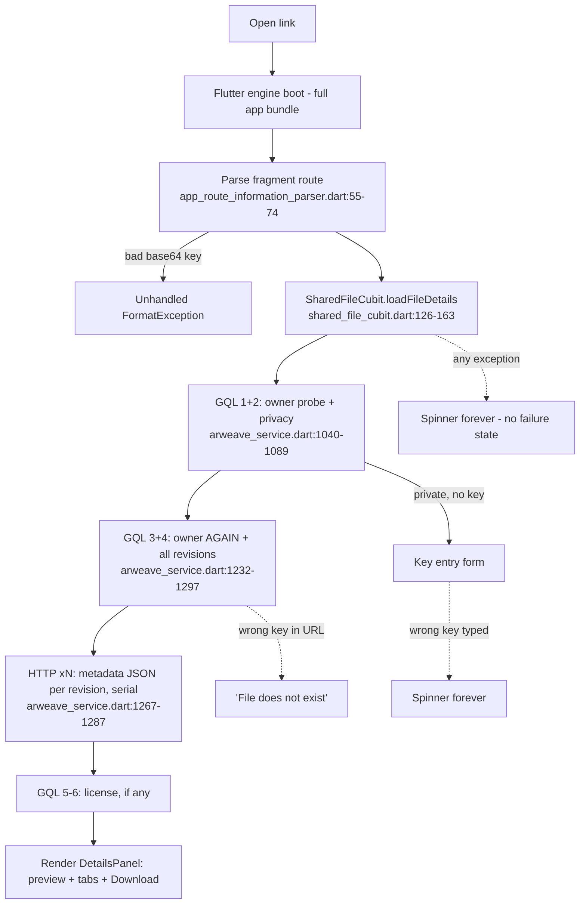

# File Sharing & Viewing UX Review

*Scope: share → view → download, both personas, `dev` branch. All line numbers verified against the working tree on 2026-08-05. Claims not verified in code are labeled **[inference]**.*

---

## 1. Executive summary

The recipient landing page is the weakest link in an otherwise well-engineered download stack. A cold recipient waits through a full Flutter app boot, then **4–6 serial GraphQL round trips plus one metadata fetch per file revision** before they even see a filename — behind a bare spinner with no failure state, so any gateway hiccup means an infinite spinner. Three of the five P0s are one-line-class bugs: the share page's Download button serves the **oldest** revision of a file, a wrong pasted key hangs forever, and a truncated link crashes route parsing. The product owner's embedded-payload direction is the right fix and is highly feasible: everything needed except `cipher`/`cipherIv` is already in the local Drift DB at share time, and an embedded payload eliminates *every* blocking GraphQL call on the view page. The second direction — the file key leaves the URL by default and travels out of band — is also right: it removes the last secret from the link, makes private links safe to QR-code, unfurl, and paste in semi-public places, and turns the private landing page into a password-gate pattern recipients already know from Dropbox and Bitwarden Send. One premise needed correcting along the way: hash routing means today's `?fileKey=` already lives inside the URL fragment and never reaches a server — the real exposures are history sync, clipboard, and the silent risk of a future path-URL migration. The deepest product gap versus WeTransfer/Dropbox is that the app link is currently *slower and more fragile* than the raw gateway link (`https://arweave.net/{txId}`) it competes with. The v2 link plus a rebuilt landing page is how the app link earns its keep: instant paint from the payload, decryption, provenance, and multi-gateway resilience the raw gateway can't offer.

---

## 2. How it works today

### 2.1 Sharer flow (file)

1. Kebab menu on a file row → **Share File** (`lib/pages/drive_detail/components/drive_explorer_item_tile.dart:524-538`), or the share icon in the details-panel toolbar (`lib/components/details_panel.dart:1492-1510`).
2. `FileShareCubit` builds the link automatically (`lib/blocs/file_share/file_share_cubit.dart:33-91`): checks the data tx status locally (failed → blocked, pending → warning), and for private drives derives the file key from the drive key (`:69`).
3. Dialog shows the link with a Copy button (`lib/components/file_share_dialog.dart:114-149`). Caption for **both** public and private files: *"Anyone can access this file using the link above."* (`lib/l10n/app_en.arb:63`).

**Three clicks** from file row to clipboard — competitive with Dropbox. No QR, no email option, no expiry/password/revoke, and no record anywhere of what you've shared (no share-history feature exists in `lib/`).

Link formats (`lib/utils/link_generators.dart:7-52`):

```text
public file:   https://app.ardrive.io/#/file/{fileId}/view
private file:  https://app.ardrive.io/#/file/{fileId}/view?fileKey={base64}
public drive:  https://app.ardrive.io/#/drives/{driveId}?name={name}
private drive: …&driveKey={base64}
```

**Folders cannot be shared.** The folder menu has no share action (`drive_explorer_item_tile.dart:411-507`); the alternatives are sharing the whole drive, or creating a **manifest** — a 6–8 step flow behind New → Advanced, public drives only, requiring a payment decision, whose success modal *does not display or copy the resulting URL* (`lib/components/create_manifest_form.dart:256-313`).

### 2.2 Recipient flow (file)



- Everything before J renders as a bare `CircularProgressIndicator` (`lib/pages/shared_file/shared_file_page.dart:169-170`).
- On success, `DetailsPanel(isSharePage: true)` renders preview card + PREVIEW/DETAILS/ACTIVITY tabs + Download (`shared_file_page.dart:50-62`, `details_panel.dart:240-491`).
- Download runs through `SharedFileDownloadCubit` → hedged multi-gateway streaming download with 60 s stall detection (`lib/blocs/file_download/shared_file_download_cubit.dart`, `lib/services/arweave/data_gateway_fallback.dart:92-158`, `lib/download/ardrive_downloader.dart:276-325`). Private files need one more GQL call for cipher tags (`shared_file_download_cubit.dart:69`).
- The download core is genuinely good: streamed to disk via StreamSaver, hedged across gateways, typed failures with actionable dialogs. Credit where due.

### 2.3 The fragment-vs-query question — verified

The app never sets a URL strategy (no `setUrlStrategy`/`usePathUrlStrategy` anywhere in `lib/` or `web/`), so Flutter web defaults to **hash routing**, and `link_generators.dart:38-50` explicitly builds `…/#/file/{id}/view?fileKey=…`. The `?fileKey=` that `app_route_information_parser.dart:59` reads as a "query parameter" is the query of the *fragment's* pseudo-URI. Consequences:

- **The key is never sent to any server** — not in request lines, not in gateway/CDN logs, not in `Referer` (fragments are excluded by spec). The premise that it leaks to server logs is incorrect for links the app generates.
- Plausible receives only synthetic per-page URLs, not the real location (`lib/utils/plausible_event_tracker/plausible_event_tracker.dart:26-41`), so no key leak there either.
- Real remaining exposures: clipboard and messaging apps (inherent to key-in-link designs — Firefox Send accepted the same), browser history and **history sync**, the key sitting visibly in the address bar for the whole session (`restoreRouteInformation` writes it back, `app_route_information_parser.dart:109-113`), and screen shares/screenshots.
- **The latent risk**: any future migration to path URLs (which §6 recommends for unfurling) would silently move `?fileKey=` into server-visible territory unless secrets are moved to a true fragment first. That ordering constraint matters.
- **Under the key-out-of-band model (§4), most of this debate dissolves**: the default link carries no secret at all. Fragment placement remains relevant only for the explicit "include key in link" opt-in (§4.6) and for legacy links, which are fragment-safe today by accident of hash routing.

---

## 3. Findings

Legend: **B** = bug, **M** = missing feature, **D** = design choice. Persona: S = sharer, R = recipient.

| # | Sev | Who | Kind | Finding & evidence | Competitor contrast / concrete failure |
|---|-----|-----|------|--------------------|----------------------------------------|
| 1 | P0 | R | B | Share page Download serves the **oldest** revision: buttons use `widget.revisions!.last` (`details_panel.dart:452,555`) but revisions are newest-first (`shared_file_cubit.dart:87-88,149`). Header/preview show the newest. The `.first`-using card in `shared_file_page.dart:171-216` is dead code (success always renders `activityPanel`, `:74-91`). | Recipient of an updated contract downloads the pre-signature draft while the page displays the new name and size. Silent, dangerous. |
| 2 | P0 | R | B | No failure state: `loadFileDetails` has no try/catch and `SharedFileState` has no error variant (`shared_file_cubit.dart:126-163`, `shared_file_state.dart:11-36`). Any GQL/network exception → spinner forever. | WeTransfer shows "Something went wrong — retry." Recipient on hotel Wi-Fi sees an infinite spinner and blames the sharer. |
| 3 | P0 | R | B | Wrong key typed into the unlock form → `getLatestFileEntityWithId` returns null → method returns while state is `SharedFileLoadInProgress` (`shared_file_cubit.dart:168-186`). Spinner forever; `SharedFileKeyInvalid` is only emitted on *exceptions*. | Recipient mistypes one character and the page hangs with no feedback. |
| 4 | P0 | R | B | Malformed/truncated `fileKey` in the URL throws inside route parsing with no try/catch (`app_route_information_parser.dart:62`). Runtime result is an unhandled router error **[inference: likely blank/stuck app]**. | Email clients truncate long URLs routinely. WeTransfer shows "this link looks broken." |
| 5 | P0 | R | B | Wrong key **in the link** → metadata decrypt fails per-entity and is skipped (`arweave_service.dart:1281-1286`) → empty list → `SharedFileNotFound` → *"The specified file does not exist."* (`shared_file_cubit.dart:162`, `app_en.arb:2165`). | The file exists; the key is bad. Recipient tells the sharer the file was deleted. Misdiagnosis by design. |
| 6 | P1 | R | D | First meaningful paint requires 4–6 serial GQL calls (owner probe is executed **twice**: `arweave_service.dart:1041,1238`) plus one HTTP metadata fetch **per revision, serially** (`:1267-1287`) — all to show one filename. | A 40-revision file costs ~44 network round trips before paint. Raw `arweave.net/{txId}` paints in one. This is the PO's "GraphQL fragility" — quantified. |
| 7 | P1 | R | B/M | Preview fetches bypass the fallback layer: `_getBytesFromCache` uses single-gateway `ArDriveHTTP().getAsBytes` (`fs_entry_preview_cubit.dart:716`); video/audio stream from a single hard gateway URL (`:88-89,216`). Download has hedged fallback; preview dies on one bad gateway. | One slow gateway = blank preview while the Download button (different code path) would have worked. |
| 8 | P1 | R | M | Private video/audio are never previewable — `_previewVideo`/`_previewAudio` emit `Unavailable` when private (`fs_entry_preview_cubit.dart:516-540`). | Loom's entire product is instant playback. An encrypted 20 MB voice memo forces a full download-and-open cycle. |
| 9 | P1 | R | M | No PDF preview at all: `_previewPdf` is a TODO (`:161-171`), `application/pdf` is absent from `documentContentTypes` (`lib/utils/constants.dart:17-49`), and `case 'pdf':` (`:120`) is dead code — MIME first-segment is `application`. | The single most-shared document type. Dropbox/Drive render PDFs inline; recipients here get "download it and find out." |
| 10 | P1 | R | B | Image preview buffers whole files into memory with **no size cap for public files**; for private files ≥100 MiB it emits `Unavailable` but a missing `return` continues to download, decrypt, and emit the image anyway (`fs_entry_preview_cubit.dart:450-453,426-480`). | Recipient on iOS Safari opens a shared 800 MB PNG scan: tab consumes ~1.6 GB and is killed by the OS **[inference from code path]**. |
| 11 | P1 | R/S | D | Multi-file/folder download builds the zip fully in memory (~2–3× total size, `multiple_download_bloc.dart:153-246`), sequentially, through single-gateway `DownloadService` with no fallback/typed errors (`lib/core/download_service.dart:21-33`), capped at 500 MiB on web (`limits.dart:8`). Not reachable by recipients at all. | WeTransfer streams multi-GB zips. A 500 MB folder is the practical ceiling here, and one gateway blip fails the batch. |
| 12 | P1 | R | M | No resume: retry restarts from byte 0 (`shared_file_download_cubit.dart:133-136`). Stall detection exists (60 s, `ardrive_downloader.dart:276-325`) but recovery = start over. | Dropped connection at 90% of a 2 GB download = 2 GB again. Gateways support HTTP Range **[inference]**; nothing uses it. |
| 13 | P1 | S | M | Folder sharing story: none (finding above) — and the manifest path, the only public-URL option, is 6–8 steps, public-drives-only, ends without showing the URL (`create_manifest_form.dart:256-313`; flow: `create_manifest_cubit.dart:62-67,86-122,278-286`). | Dropbox: right-click folder → copy link. Two actions. |
| 14 | P1 | R/S | M | Link unfurling: static OG tags only (`web/index.html:8-13`, `og:url` even points at `ardrive.io`). Hash routing means no server can *ever* see the fileId, so per-file unfurls are structurally impossible without a URL change. | A WeTransfer link in Slack shows filename+size; an ArDrive link shows a generic logo card. Cheap perceived-quality win, currently unreachable. |
| 15 | P1 | R | B | Thumbnails never render on the share page: `ThumbnailRepository.getThumbnail` starts with a local-DB drive lookup that throws for recipients (`lib/drive_explorer/thumbnail/repository/thumbnail_repository.dart:50-52`) → generic icon, even though the thumbnail txId is on-chain and in the revision data (`data_table_item.dart:277-278`). | The one visual trust signal a recipient could get before downloading, discarded on a technicality. |
| 16 | P1 | S | D | Privacy is illegible at share time: identical "Anyone can access…" copy for public and private files (`file_share_dialog.dart:151-156`, `app_en.arb:63`); nothing says the decryption key is embedded in the link, or that it can never be rotated. | Firefox Send explained "anyone with the link can decrypt." Sharers paste private links into public channels not knowing what they're handing over. |
| 17 | P1 | R | B | The six newest download-error strings (`downloadNetworkError*`, `downloadRateLimited*`, `downloadFileNotFound*`) are missing from **all five** non-EN locales; plus hardcoded English in the recipient path: `'Downloading'` (`file_download_dialog.dart:388`), `'Download cancelled'` (`:472-473`), `'Preview unavailable'` (`fs_entry_preview_widget.dart:32-35`), `'Loading...'`, `'Uploaded By'`, `'License'` etc. in `details_panel.dart` (`:1047,778,869`). | Spanish recipient hitting a 429 reads English. |
| 18 | P2 | R | D | Recipient page leaks protocol jargon: "Data Tx ID", "Metadata Tx ID", "File ID" rows with viewblock links (`details_panel.dart:782-849`); tabs "PREVIEW / DETAILS / ACTIVITY"; error term "Invalid Keyfile" for what the UI elsewhere calls a File Key (`app_en.arb:1258` vs `:724`). | WeTransfer shows filename, size, expiry. Nothing else. |
| 19 | P2 | R | B | `user-scalable=no` viewport (`web/index.html:71`) plus zero zoom/pan in the image viewer (no `InteractiveViewer` anywhere; render is `MemoryImage` + `BoxFit.contain`, `fs_entry_preview_widget.dart:1420-1427`) — mobile recipients cannot zoom a shared photo at all, and pinch-zoom suppression is a WCAG 1.4.4 failure. | Every competitor allows pinch zoom. |
| 20 | P2 | R | D | Cold boot ships the entire app (drive explorer, upload pipeline, sync) to a recipient who needs one page; heavy JS is lazy-loaded (`web/index.html:26-62`) but there is no route-level split of `main.dart.js` **[inference: Flutter web has no default route splitting]**. | WeTransfer's download page is a few hundred KB. |
| 21 | P2 | R | D | Drive-share recipients get the full app shell in anonymous mode and must wait for a drive sync before seeing any file list (`app_router_delegate.dart:52-56,156-169`) **[inference on sync wait: routing verified, sync timing not measured]**. | A Dropbox folder link renders a file list near-instantly. |
| 22 | P2 | R | B | Latent limit bugs: `publicDownloadSafariSizeLimit` is used by the single-file Safari gate (`shared_file_download_cubit.dart:26-32`) but ignored by `calcDownloadSizeLimit` (`limits.dart:29-40`), and the multi-download passes `hasPrivateFiles` into the `isPublic` parameter (`multiple_download_bloc.dart:105` vs `limits.dart:55-57`) — currently masked because the constants coincide. | Becomes a real bug the day any constant diverges. |
| 23 | P2 | R | D | Image preview bytes flow through a **static app-global** `ValueNotifier` (`fs_entry_preview_cubit.dart:38-39`) — two mounted previews clobber each other. | Fragility, not yet user-visible on the share page. |
| 24 | P1 | R | B | **No private web download of any size is cryptographically authenticated.** Cipher is size-split: `< 100 MiB` → AES256-GCM, `≥` → AES256-CTR (`packages/ardrive_uploader/lib/src/data_bundler.dart:664`, `constants.dart:3`). CTR has no MAC (`packages/ardrive_crypto/lib/src/entities.dart:45`); the GCM *streaming* decryptor trims and ignores the MAC (`packages/ardrive_crypto/lib/src/stream_aes.dart:120-149`), and web/desktop downloads route both ciphers through it (`lib/download/ardrive_downloader.dart:243-269`). Only mobile GCM (`:81-104`) and buffered previews verify. `authenticate.dart` is entirely commented out. | A gateway (or on-path attacker on a misconfigured gateway) can substitute ciphertext and the client saves whatever decrypts. Fix design: `docs/FILE_SHARING_REDESIGN_PLAN.md` §3 (buffer-and-verify GCM, streamed signature verification for CTR). |

Genuinely good and worth keeping as-is: `DataGatewayFallback` (hedged downloads, GAR-aware, arweave.net last resort — `data_gateway_fallback.dart`), the video player feature set (seek, buffered-range display, fullscreen, speed, share-page ±10 s — `fs_entry_preview_widget.dart:144-260,482-598`), and the streaming save path with stall detection.

---

## 4. The share-link redesign: embedded payload, key out of band

Two pieces of product-owner direction combine here: (1) the link should carry everything needed to locate and decode the bytes so the view page never depends on GraphQL, and (2) **the file key should not be in the URL by default** — it is a password, handed over separately. Together they produce a link that contains rich *public* routing data and zero secrets.

### 4.1 What the app already has at share time

From the Drift schema, all locally available the moment the share dialog opens:

| Field | Source | Status |
|---|---|---|
| `fileId`, `name`, `size`, `dataContentType` | `file_entries.drift:2-11` | ✅ local |
| `dataTxId` | `file_entries.drift:13` | ✅ local |
| `metadataTxId` (latest revision) | `file_revisions.drift:14` | ✅ local |
| `bundledIn` (bundle tx id) | `file_entries.drift:17` / `file_revisions.drift:20` | ✅ local |
| `licenseTxId`, `thumbnail` (JSON incl. thumbnail txId), `pinnedDataOwnerAddress` | `file_entries.drift:15-21` | ✅ local |
| drive `ownerAddress` | `drives.drift:5` | ✅ local |
| `fileKey` | derived, `file_share_cubit.dart:69` | ✅ local |
| data tx status (pending/confirmed) | `network_transactions.drift:4`, read at `file_share_cubit.dart:40-48` | ✅ local |
| **`cipher`, `cipherIv`** | tags on the data tx, fetched today via GQL at download time (`shared_file_download_cubit.dart:69-77`) | ❌ one `getTransactionDetails` GQL call at **share** time (`arweave_service.dart:235-240`) — cheap, sharer is online in-app |
| **data item offset in bundle** | not stored; no GraphQL/API exposes it | ❌ not feasible — and not needed (see 4.5) |

### 4.2 What the payload eliminates on the view page

Today's blocking work (§2.2): owner probe ×2, privacy probe, all-revisions query, N serial metadata fetches, license queries, and (private) the cipher-tag query at download. **An embedded payload eliminates every blocking GraphQL call.** What remains:

- The data bytes themselves (unavoidable).
- *Optional, deferred, non-blocking*: revision history for the ACTIVITY tab, license badge, pin attribution, and a freshness check (§4.6). None should gate first paint.

### 4.3 Proposed link schema (v2)

The governing rule: **embed everything except the key.** `cipher` and `cipherIv` are *not* secrets — they are public tags on the data transaction today (`docs/ArweaveFS.md:43,121-122`) and are cryptographically inert without the key. Only the file key decrypts anything.

| Param | Content | Secret? | Placement | Req? | Missing ⇒ |
|---|---|---|---|---|---|
| `v` | schema version, `2` | no | query | required | treat as v1 (today's behavior) |
| `dtx` | data tx / data item id (43 ch) | no | query | required for fast path | fall back to GQL resolution |
| `mtx` | metadata tx id of the shared revision | no | query | strongly recommended | skip verification + freshness anchor |
| `own` | owner address | no | query | recommended | derive from `mtx` fetch or GQL |
| `n` | filename (URL-encoded, truncate ~120 ch) | no, but **sensitive for private files** (see below) | query | recommended | "Shared file" / "Encrypted file" until resolved |
| `s` | size in bytes | no (ciphertext length is public on-chain anyway) | query | recommended | omit size chip; no preview budget check |
| `ct` | content type | no, same caveat as `n` | query | recommended | infer from filename |
| `c` | cipher name (private only) | **no** — public tag | query | required if private | 1 GQL at download, as today |
| `iv` | Cipher-IV, base64 (private only) | **no** — public tag | query | required if private | 1 GQL at download, as today |
| `in` | `bundledIn` id | no | query | optional | none (diagnostics/future) |
| `thn` | thumbnail tx id | no | query | optional | icon instead of image |
| `k` | **file key** (43 ch) | **YES** | **out of band by default**; fragment `#k=` only via explicit opt-in (§4.6) | never required | key-entry page (§4.5) |

**Default private link (no secret anywhere, ~360 chars):**

```text
https://app.ardrive.io/#/file/8f3c…-uuid/view?v=2&dtx=nS7hxbLQ…43&mtx=S1QzT9Yb…43&own=Zvp8dEkO…43&n=Q3%20Report.pdf&s=4821133&ct=application%2Fpdf&c=AES256-GCM&iv=9tR2kX0pLmQz
```

**Opt-in "key in link" variant:** same + `#k=aBcD…43` appended. **Packed alternative (~230 chars):** `…view?v=2&p=<base64url CBOR blob>`.

**Recommendation: named short params over the packed blob.** (a) Human-inspectable — a support engineer can read a broken link; (b) graceful degradation is free — unknown params ignored, absent params fall back per-field; (c) the ~130-char saving doesn't cross any threshold that matters: iMessage/Slack/WhatsApp handle multi-thousand-char URLs, and for QR codes encode a minimal variant (`v`,`dtx`,`c`,`iv`) either way. Versioning: `v=2` gates the fast path; links without `v` run today's resolver forever.

**Residual metadata exposure of a keyless private link** — judged acceptable with one decision to make: `dtx`, `own`, `c`, `iv`, and the ciphertext size are all already public on-chain; the link adds no cryptographic exposure, only *correlation* (this URL ⇒ that ciphertext). The one genuinely new disclosure is **`n`/`ct`**: for private files the filename and content type live inside the *encrypted* metadata JSON (`docs/ArweaveFS.md:100-116`) and are not otherwise public. Embedding them makes the keyless landing page informative (Bitwarden-Send-style: show what you're unlocking); omitting them gives a 1Password-style opaque gate. Recommend **embed by default with a "hide file name in link" toggle** for sensitive shares → Open Question 6.

Nested-fragment mechanics verified for the opt-in: with hash routing, the router's `location` is everything after the first `#`, so `/file/…/view?…#k=…` parses via `Uri.parse(location).fragment` in `app_route_information_parser.dart:17` — a cold load can read it. And because the default link now carries no secret, it is safe under a future path-URL migration (§6/B1): the locator becomes server-visible (good — enables per-file OG unfurls and QR codes), while `#k=` opt-in links keep the key client-side.

### 4.4 Backwards compatibility and parser precedence

Non-negotiable and cheap. `app_route_information_parser.dart:55-74` today handles exactly two shapes: `?fileKey=` present → keyed page; absent → keyless page (`:69-71`), which already routes to the key-entry state (`SharedFileIsPrivate`, `shared_file_page.dart:149-167`). The v2 parser accepts three key sources with this precedence:

1. `#k=` in the inner fragment (new opt-in) — wins if present;
2. `?fileKey=` legacy query param — **honored forever**; permanent links in the wild must never break;
3. neither → key-entry page.

If both are somehow present and disagree, prefer `#k=` and log; both decode through the same guarded base64 path (fixing F4 at the same time). v1 links with no payload params simply take the GQL fallback path — no behavioral change.

### 4.5 The recipient's key-entry experience (centerpiece of the private landing page)

What exists today: logo + *"This file is encrypted."* + an obscured text field hinting *"Enter File Key"* + an Unlock button (`shared_file_page.dart:149-167`). No filename, no size, no guidance on where the key comes from, no show/hide toggle; a wrong key either pops a modal titled "Error / Invalid Keyfile" (`:38-46`) or — via the null-return path — hangs forever (F3). Nothing tells the recipient this is *normal* and that the sender has their key.

What ArFS permits the page to show without a key (verified): File-Id, upload time, owner address, cipher/IV, and ciphertext size are public; **filename, true size, and content type are inside the encrypted metadata** (`docs/ArweaveFS.md:100-116`) — so pre-key informativeness depends entirely on whether the link embeds `n`/`s`/`ct` (§4.3). With the recommended default, the page can show what you're unlocking; for v1 legacy keyless links it can honestly show only "Encrypted file · 4.8 MB".

Proposed locked state (mirrors Dropbox password links / Bitwarden Send):

```text
┌──────────────────────────────────────────────┐
│  ArDrive ▪ Permanent file sharing            │
│                                              │
│         🔒  Q3 Report.pdf                    │  ← from payload; else "Encrypted file"
│             4.8 MB · PDF · Encrypted         │
│                                              │
│  This file is protected with an access key.  │
│  The person who shared it should have sent   │
│  you the key separately.                     │
│                                              │
│  ┌────────────────────────────────────┐      │
│  │  Paste access key…            [👁] │      │
│  └────────────────────────────────────┘      │
│  ┌────────────────────────────────────┐      │
│  │           Unlock file              │      │
│  └────────────────────────────────────┘      │
│  Your key is used only on this device and    │
│  is never sent anywhere.                     │
└──────────────────────────────────────────────┘
```

Behavior details:

- **Paste-first affordance**: a paste icon/button in the field; auto-submit on paste of a plausibly-shaped key (base64url, ~43 ch) with client-side shape validation *before* any network/crypto attempt — instant "this key looks incomplete" feedback for truncated pastes instead of a decrypt round trip.
- **Show/hide toggle** on the obscured field (missing today).
- **Wrong key** = inline, human, recoverable: *"That key didn't work. Check for missing characters and try again."* under the field, field kept populated and selected — not a modal, not "Invalid Keyfile", never a spinner (fixes F3/F5 semantics; the privacy probe already tells us the file exists, so "does not exist" must never appear for a key failure).
- **Session persistence**: once validated, hold the `SecretKey` in memory for the session (the cubit already does this post-submit) so preview, download, and retry never re-prompt. A browser refresh re-prompts by default. If refresh-resilience is wanted, the acceptable store is **`sessionStorage`, opt-in via a "Remember while this tab is open" checkbox**: tab-scoped, cleared on tab close, not shared across tabs — the residual risk (some browsers persist session-restore data to disk) is proportionate for a recipient-side key that the sharer has already transmitted through at least one chat system. Never `localStorage`, never cookies, never for the sharer's own drive keys.

### 4.6 The sharer's side: two things to hand over

The share dialog for a private file becomes a two-artifact handover with independent copy actions and an explicit nudge toward separate channels — the security benefit evaporates if link and key travel in the same message.

```text
┌──────────────────────────────────────────────────────┐
│  Share "Q3 Report.pdf"                    (Private)  │
│                                                      │
│  Link                                                │
│  ┌────────────────────────────────┐  ┌────────────┐  │
│  │ https://app.ardrive.io/#/file… │  │ Copy link  │  │
│  └────────────────────────────────┘  └────────────┘  │
│  Access key                                          │
│  ┌────────────────────────────────┐  ┌────────────┐  │
│  │ ••••••••••••••••••••••••  [👁] │  │ Copy key   │  │
│  └────────────────────────────────┘  └────────────┘  │
│                                                      │
│  ⓘ Send the key through a different channel than     │
│    the link — for example, link by email, key by     │
│    text message. Anyone who has both can open this   │
│    file, and that can never be undone.               │
│                                                      │
│  ☐ Include key in link (less secure)                 │
│    One link opens the file directly. Anyone who      │
│    sees that link can decrypt this file, forever.    │
└──────────────────────────────────────────────────────┘
```

- **Keep "include key in link" as an explicit opt-in** for low-stakes sharing — it preserves today's one-paste convenience where it's genuinely fine (memes, non-sensitive docs) and keeps the migration story simple. When checked, the key goes in the **fragment (`#k=`), never the query**, and the checkbox copy above states the tradeoff in plain words. Default unchecked; remember the choice per user, not per file.
- Copy buttons fire independent confirmations ("Link copied" / "Key copied") so the sharer always knows which artifact is on the clipboard.
- Public files keep the single-link dialog; this split UI appears only for private files, which finally makes the public/private difference *legible* at the moment of sharing (F16).

### 4.7 Language: retire "file key" for recipients

"File key" / "drive key" / "keyfile" are protocol jargon; to a recipient this is an access key (password-like). Recipient-facing ARB strings to change (all in `lib/l10n/app_en.arb`):

| Key | Today | Proposed |
|---|---|---|
| `sharedFileIsEncrypted` (:1983) | "This file is encrypted." | "This file is protected with an access key." |
| `enterFileKey` (:724) | "Enter File Key" | "Paste access key" |
| `invalidKeyFile` (:1258) | "Invalid Keyfile" (wrong term even today) | "That key didn't work. Check for missing characters and try again." |
| `unlock` (:2467) | "Unlock" | "Unlock file" |
| *(new)* | — | "The person who shared this file should have sent you the key separately." |
| *(new, sharer)* | — | "Access key", "Copy key", separate-channel nudge, opt-in checkbox copy (§4.6) |

Localization cost: ~8–10 changed/new keys × 5 non-EN locales (es, hi, ja, zh, zh-HK) — budget real translation, since the pipeline already has drift (the six download-error keys missing everywhere, F17). Sharer-side technical contexts (details drawer, docs) may keep "File Key" as the formal term.

### 4.8 Trust: what a crafted link can do

Today, the displayed name/size come from ArFS metadata signed (via tx ownership) by the fileId's **first writer** (`FirstFileEntityWithIdOwner.graphql:5`, `HEIGHT_ASC`) — but a fileId is free to mint, so "attacker shares malicious bytes under a nice filename" is already possible today by simply uploading them. What v2 *changes*: the URL itself asserts `dtx`+`n`+`ct`, so a link author can point `Invoice.pdf` at **any existing tx's bytes** without owning or uploading anything, and (for public files) nothing decryption-related would catch it. Required mitigations:

1. **Background verification against `mtx`**: fetch the metadata JSON (one `/raw/` fetch — cheaper than today's N fetches), confirm it names this `dtx`, this size, this name; confirm `mtx`'s owner via one GQL or the tx header. Mismatch → banner: *"This link's details don't match the file's record"* + show verified values.
2. **Before saving**, compare streamed byte count against asserted `s`; private AES-GCM downloads get integrity from the auth tag (`ardrive_downloader.dart:249-269`), public files get the size check plus (optionally) the gateway-verified download path already available (`verifyDownload`, `shared_file_download_cubit.dart:78`).
3. Treat embedded display fields as *hints*: render immediately, reconcile silently, warn loudly on mismatch. Blocking first paint on verification would surrender the entire latency win — recommend non-blocking with a pre-download hard check.

Note that the out-of-band-key model buys a free integrity property for private files: bytes substituted by a malicious link fail AES-GCM authentication under the real key (`ardrive_downloader.dart:249-269`), so spoofing is chiefly a *public-file* problem.

### 4.9 Bundle offsets and range requests

Skip them. Offsets aren't in the DB, aren't exposed by GraphQL, and AR.IO gateways already resolve data items by id directly — that is their core function. Range requests matter for **resume** (F12), not for locating bytes: `GET /{dtx}` with a `Range` header against any AR.IO gateway is the resume path **[inference: standard AR.IO behavior, verify per-gateway]**. Keep `in=` as an optional diagnostic field only.

### 4.10 Staleness semantics

Embedding `dtx` freezes the link at the shared revision. Today's page nominally resolves "latest" (and actually downloads *oldest* — F1), so this is a real semantic choice, not a regression:

- **Option A — pinned snapshot**: link = exactly the bytes you shared. Predictable, offline-verifiable, matches WeTransfer mental model.
- **Option B — live pointer**: background GQL (non-blocking, single query anchored on `own`+fileId) checks for newer revisions; if found, banner: *"A newer version of this file exists — view latest."*
- **Recommendation: A as the transport default, B's check layered on non-blockingly** — the fast path never waits on it, and the banner preserves the "live" expectation without re-introducing GQL fragility. Whether the *download button* silently upgrades is the product call → Open Question 1.

### 4.11 Resilience layer

Exists, unevenly applied:

| Path | Today | Fix |
|---|---|---|
| File download | Hedged multi-gateway (primary + 2 GAR + arweave.net, 1.5 s stagger) + 60 s stall detection (`data_gateway_fallback.dart:92-158`, `ardrive_downloader.dart:276-325`) | Keep. Add Range-based resume. |
| Preview bytes | Single gateway, no retry (`fs_entry_preview_cubit.dart:716`) | Route through `gatewayFallback.fetchData` — small change. |
| `<video>`/`<audio>` URL | Single gateway URL (`:88-89`) | On player error, re-init against next gateway from the same client list. |
| GraphQL | 8 retries w/ backoff on primary *before* trying fallback, and only on 429/5xx string match (`graphql_retry.dart:26-63`) | For interactive contexts: 2 attempts then fail over; hedge primary vs arweave.net/graphql. Mostly moot once v2 links remove GQL from the critical path. |
| Multi-download | None (`download_service.dart:21-33`) | Adopt `DataGatewayFallback` + typed exceptions. |

---

## 5. Proposed target experience (recipient landing page)

One column, mobile-first. Filename-first, Download always above the fold, jargon in a collapsible drawer.

```text
┌──────────────────────────────────────────────┐
│  ArDrive ▪ Permanent file sharing        [?] │  ← thin trust strip, links to 1-pager
├──────────────────────────────────────────────┤
│  [thumb / type icon]                         │
│  Q3 Report.pdf                               │  ← from link payload: instant
│  4.8 MB · PDF · Shared by Zvp8…dEkO ✓        │  ← ✓ appears after mtx verification
│                                              │
│  ┌────────────────────────────────────────┐  │
│  │            ⬇  Download                 │  │  ← primary, full-width on mobile
│  └────────────────────────────────────────┘  │
│          ▶ Preview (opens inline)            │
│                                              │
│  🔒 Unlocked with your access key. The key   │  ← private only, post-unlock
│     never leaves this device.                │
│                                              │
│  ▸ File details          ▸ Version history   │  ← lazy; where txids/license live
│  Stored permanently on Arweave · What is     │
│  ArDrive?                                    │
└──────────────────────────────────────────────┘
```

**States**: *Loading* — skeleton of the card above with name already filled from the payload (only the thumbnail shimmers); *Locked* — the private key-entry gate of §4.5, with filename/size shown when the link embeds them; *Ready* — above; *Previewing* — media replaces the card top, Download persists below; *Downloading* — inline progress bar on the button (`4.8 MB · 62% · 12s left`), not a modal; *Error* — per-cause: 

- damaged link → *"This link looks incomplete. Ask the sender to copy it again."*
- wrong key → *"That key didn't work. Check for missing characters and try again."* (inline, in the Locked state)
- not yet available → *"This file was uploaded recently and is still propagating. Retrying automatically…"* (auto-retry with countdown)
- gateway trouble → *"Having trouble reaching the network. Trying another route…"* (hedged retry, then manual Retry)

Primary copy strings: `Download`, `Preview`, `Shared by {addr}`, `Verified`, `Paste access key`, `Unlock file`, `Stored permanently on Arweave`. Kill on this page: "Data Tx ID" (→ details drawer as "Transaction"), "PREVIEW/DETAILS/ACTIVITY" tab chrome, "Invalid Keyfile", "File Key".

---

## 6. Recommendations

### Quick wins (< 1 day each)

| | Fix | Files | Finding |
|---|---|---|---|
| QW1 | `.last` → `.first` for share-page downloads (or better: a named `latestRevision` getter) | `lib/components/details_panel.dart:452,555` | F1 |
| QW2 | Add `SharedFileLoadFailure` state + try/catch + Retry button | `shared_file_cubit.dart`, `shared_file_state.dart`, `shared_file_page.dart` | F2 |
| QW3 | Emit `SharedFileKeyInvalid` when the entity lookup returns null | `shared_file_cubit.dart:173-179` | F3 |
| QW4 | try/catch around key decode; route to keyless share page with "link damaged" notice | `app_route_information_parser.dart:59-71` | F4 |
| QW5 | Distinguish wrong-key from not-found (privacy is already known at that point) | `shared_file_cubit.dart:133-162` | F5 |
| QW6 | Add missing `return` at oversized-private-image guard; add a public image size cap | `fs_entry_preview_cubit.dart:450-453` | F10 |
| QW7 | Route preview fetches through `gatewayFallback.fetchData` | `fs_entry_preview_cubit.dart:701-731` | F7 |
| QW8 | Interim private-share copy (until M1 ships, today's links *do* carry the key): "this link contains the decryption key; anyone with it can decrypt, forever" | `file_share_dialog.dart`, `app_en.arb` | F16 |
| QW9 | Add the 6 missing ARB keys to es/hi/ja/zh/zh-HK; localize `'Downloading'`, `'Download cancelled'`, `'Preview unavailable'` | `lib/l10n/*.arb`, `file_download_dialog.dart:388,472`, `fs_entry_preview_widget.dart:33` | F17 |
| QW10 | Show + copy the manifest URL in the success modal | `create_manifest_form.dart:256-313` | F13 |
| QW11 | Remove `user-scalable=no` | `web/index.html:71` | F19 |

### Meaningful projects (1–2 weeks)

- **M1 — v2 embedded-payload links, keyless by default** (§4.3–4.4, §4.6): `link_generators.dart`, `file_share_cubit.dart` (one added `getTransactionDetails` at share time; two-artifact dialog with independent copy actions and the `#k=` opt-in), `file_share_dialog.dart`, `app_route_information_parser.dart` (three-source key precedence, legacy `?fileKey=` honored forever), `app_route_path.dart`, `shared_file_cubit.dart` (payload-first resolver; GQL demoted to fallback + lazy activity tab). → F6, F2, F5, F16.
- **M2 — Landing page rebuild** per §5 including the Locked key-entry gate of §4.5 (paste-first field, inline wrong-key state, session key retention) and the §4.7 language changes across 6 locales, replacing the `DetailsPanel(isSharePage)` co-tenancy with a dedicated recipient widget tree. → F14(partial), F16, F18, F21, F3/F5 UX.
- **M3 — PDF preview**: public via blob/iframe on web, decrypt-to-blob for private ≤ cap; fix the constants gap. → F9.
- **M4 — Private media playback**: decrypt-to-blob-URL for audio/video ≤ ~100 MB cap (MSE streaming decrypt is the bigger-bet extension). → F8.
- **M5 — Multi-download rework**: streaming zip encoder, `DataGatewayFallback` adoption, byte-level progress. → F11, F22.
- **M6 — Resume via Range requests** on retry/stall, keeping `bytesSaved` offset. → F12.
- **M7 — Share-page thumbnails**: bypass the DriveDao lookup when a thumbnail txId is in the revision/payload. → F15.
- **M8 — Folder share links**: share dialog for folders emitting the existing `/#/drives/{id}/folders/{folderId}` route (parser already handles it, `app_route_information_parser.dart:46-51`) with a folder-scoped anonymous view. → F13.

### Bigger bets (product/protocol decisions)

- **B1 — Server-visible share path for unfurling**: move new share links to `https://app.ardrive.io/share/{fileId}?v=2&…` (path URL strategy for this route), with an edge worker or AR.IO gateway sidecar emitting per-file OG tags from the locator params; legacy `#/file/` links redirect client-side with fragment preserved. The keyless-by-default model (§4.3) is what makes this safe and valuable: a link with no secret can be QR-coded, unfurled in Slack with a real filename/size/thumbnail card (private files unfurl as "Encrypted file shared via ArDrive"), and pasted in semi-public places. Must land *after* M1 so no key-bearing default links exist. → F14, and unlocks the "why not a raw gateway link" answer.
- **B2 — Lightweight recipient bundle**: separate minimal entrypoint for the share route to cut cold boot from full-app to landing-page scale. → F20.
- **B3 — App-layer link controls** (honest ones): ArNS-indirection links the sharer can repoint/blank ("revocable *pointer*, not revocable *data*"), app-enforced expiry labels, and password-protection as a second KDF layer **for new uploads only**. → §7.
- **B4 — Share manager**: a "Links you've created" panel (local DB first; optional Plausible-based open counts). → sharer-side visibility gap.
- **B5 — One-click folder publish**: collapse the manifest flow to a single confirm (auto name, default payment), surfacing the URL. → F13.

---

## 7. What permanence forbids — plainly

| Impossible | Why | Closest credible alternative |
|---|---|---|
| Deleting or expiring public data | Bytes are replicated on-chain forever | App-side hide + expiry *labels* (advisory only, must be labeled as such); don't advertise "expiring links" without the caveat |
| Revoking a shared private file's key | The key decrypts the on-chain ciphertext forever; a leaked key is a permanent leak | Re-upload under a new key + repoint an indirection link; old ciphertext stays decryptable to key holders — say so in UI |
| Key rotation in place | Same | Same (new revision under new key; old revisions remain) |
| True view limits / burn-after-read | No server mediates access; any gateway serves the bytes | App-enforced counters affect only the app page, not gateways — cosmetic; probably not worth shipping |
| Password protection for existing files | Key derivation is fixed at upload | The out-of-band access key (§4.5–4.6) *is* the password pattern, available today for every private file; a second KDF layer at upload time remains the protocol conversation for human-memorable passwords on *new* files |

The honest framing for UI copy: *public = published forever; private = secret-forever-or-never.* The share dialog should say this once, clearly, at the moment of sharing (QW8).

---

## 8. Open questions for the product owner

1. **Link semantics**: v2 links pin the shared revision, with a non-blocking "newer version exists" banner. Should the Download button serve the pinned bytes or silently upgrade to latest? (One line unblocks M1's resolver.)
2. **URL shape**: may new share links move to path-based `/share/{fileId}` — now secret-free by default — to make per-file unfurls and QR codes possible, accepting a client-side redirect shim for legacy `#/file/` links? (Gates B1; M1 works either way.)
3. **Verification posture**: is background verify-and-warn (render from payload immediately, banner on mismatch, hard check before save) acceptable, or must render block until `mtx` verification completes? (Gates M1 UX.)
4. **Freshness of the ACTIVITY tab**: may revision history load lazily after first paint (and be absent entirely if GQL is down)? (Gates the zero-GQL claim.)
5. **Large-file ambition**: is ~500 MB–2 GB browser zip/download ceiling acceptable for this year, or do M5+M6 (streaming zip + resume) get funded now?
6. **Filename in keyless private links**: default-embed `n`/`s`/`ct` so the locked page shows what you're unlocking (recommended, with a "hide file name" toggle), or default-opaque 1Password-style? (Gates the §4.3 schema default and the §4.5 locked-state design.)
7. **Key-in-link opt-in**: does the "Include key in link (less secure)" checkbox survive (recommended: yes, fragment-only, default off, choice remembered per user), or is out-of-band the *only* mode for private files? (One line settles the §4.6 dialog.)
8. **Key persistence for recipients**: is the opt-in "Remember while this tab is open" via `sessionStorage` acceptable (recommended), or memory-only with re-prompt on every refresh? (Gates §4.5 behavior.)
